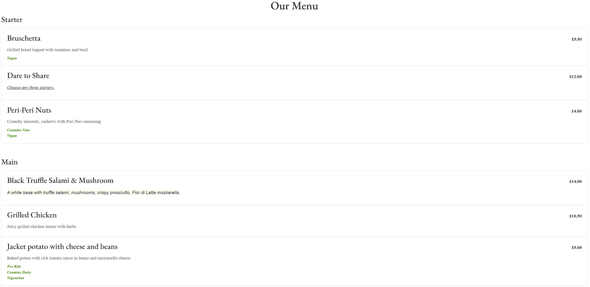
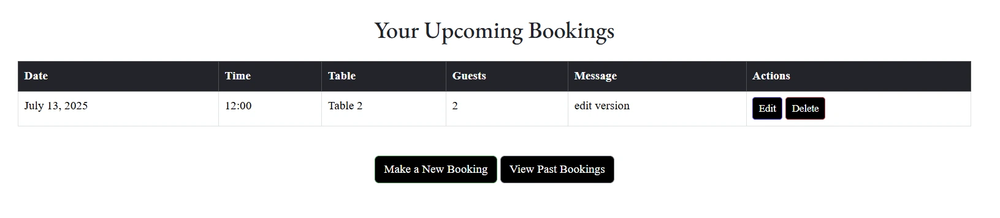

# The Wooden Spoon

The Wooden Spoon is a fictional restaurant, which has a amazing setting and heartfelt hospitality promise a dining experience as memorable as the view.
Our each dish crafted from the freshest ingredient sourced and we honour the flavour of the region in every bite.
The live link can be found here: [Live Site - The Wooden Spoon](https://the-wooden-spoon-cfb803cde318.herokuapp.com/)

# User-Experience-Design

## The-Strategy-Plane

### Site-Goals

The site is aimed to help restaurant staff to easily manage the menus displayed on the website, as well as keeping track of upcoming bookings and capacity, editing and deleting as neccessary. 

The site also aims to provide customers with a simple, hassle free way to make reservations online or by calling the restaurant. They will also be able to cancel their bookings or update when needed.

### Agile Planning

This project was developed using agile methodologies by delivering small features in incremental sprints. spaced out evenly over four weeks.

All projects were assigned to epics, prioritized under the labels, Must have, should have, could have."Must have" stories were completed first, "should haves" and then finally "could haves". It was done this way to ensure that all core requirements were completed first to give the project a complete feel, with the nice to have features being added should there be capacity.

The Kanban board was created using github projects and can be located [here](https://github.com/users/Neelp20/projects/17/views/1) and can be viewed to see more information on the project cards. All stories except the documentation tasks have a full set of acceptance criteria in order to define the functionality that marks that story as complete.

#### Epics

The project had 7 main Epics (milestones):

**EPIC 1 - Base Setup**

The base setup epic is for all stories needed for the base set up of the application. Without the base setup, the app would not be possible so it was the first epic to be delivered as all other features depend on the completion of the base setup.

**EPIC 2 - Stand alone Pages**

The stand alone pages epic is for small pages that did not have enough stories to warrant their own full epics. Instead of creating epics for tiny features, these small deliverables were all added under this epic.

**EPIC 3 - Authentication Epic**

The authentication epic is for all stories related to the registration, login and authorization of views. This epic provides critical functionality and value as without it the staff would not be able to managed the bookings securely without regular site visitors also being able to see and perform actions.

**EPIC 4 - Menu**

The menu epic is for all stories that relate to the creating, deleting, editing and viewing of menus. This allows for regular users to view menus and for staff to manage them with a simple UI interface.

**EPIC 5 - Bookings**

The booking epic is for all stories that relate to creating, viewing, updating and deleting bookings. This allows the staff to easily view upcoming bookings, manage the bookings and also for customers to book and manage their own reservations.

**EPIC 6 - Deployment Epic**

This epic is for all stories related to deploying the app to heroku so that the site is live for staff and customer use.

**EPIC 7 - Documentation**

This epic is for all document related stories and tasks that are needed to document the software development lifecycle of the application. It aims to deliver quality documentation, explaining all stages of development and necessary information on running, deploying and using the application.

#### User Stories

The following user stories (by epic) were completed:

**EPIC 1 - Base Setup**

As a developer, I need to create the base.html page and structure so that other pages can reuse the layout

As a developer, I need to create static resources so that images, css and javascript work on the website

As a developer, I need to set up the project so that it is ready for implementing the core features

As a developer, I need to create the footer with social media links and contact information

As a developer, I need to create the navbar so that users can navigate the website from any device

**EPIC 2 - Stand alone Pages**

As a developer, I need to implement a 404 error page to alert users when they have accessed a page that doesn't exist

As a developer, I need to implement a 500 error page to alert users when an internal server error occurs

As a developer, I need to implement a 403 error page to redirect unauthorised users to so that I can secure my views

As a restaurant owner, I would like a home page so that customers can view information on my restaurant

**EPIC 3 - Authentication Epic**

As a developer, I need to implement allauth so that users can sign up and have access to the websites features

As a Site Owner, I want users to verify their email when registering an account so that I can ensure that a valid email address is being used.

As a site owner, I would like the allauth pages customized to that they fit in with the sites styling.

**EPIC 4 - Menu**

As a staff user, I want to be able to create a new menu/menu items when we have new dishes to offer

As a user, I would like to be able to view menus so that I can decide if I would like to dine at the restaurant

As a staff user, I want to be able to edit a menu/menu items when updates are needed

As a staff member, I would like to receive feedback when I create or update menus so that I can see they have worked

As a staff user, I want to be able to delete a menu when it is no longer used

**EPIC 5 - Booking**

As a user, I would like to be able to create a new booking when I want to visit the restaurant

As a user, I would like to view my bookings when I need to check the information

As a user, I would like to be able to edit a booking so that I can make changes when needed

As a user, I would like to receive feedback when I create a booking or edit one so I know it was completed successfully

As a staff user, I want to be able to search a booking by name/email or date to save time searching

As a user I would like to delete a booking when I no longer require it

**EPIC 6 - Deployment Epic**

As a developer, I need to set up whitenoise so that my static files are served in deployment

As a developer, I need to deploy the project to heroku so that it is live for customers

**EPIC 7 - Documentation**

Tasks:

* Complete readme documentation
* Complete testing documentation write up

## The-Scope-Plane

* Responsive Design - Site should be fully functional on all devices from 320px up
* Hamburger menu for mobile devices
* Ability to perform CRUD functionality on Menu and Bookings
* Restricted role based features
* Home page with restaurant information

## The-Structure-Plane

### Features

``USER STORY - As a developer, I need to create the navbar so that users can navigate the website from any device``

Implementation:

**Navigation Menu**

 The Navigation contains links for Home, Menu, Bookings and has allauth options.

 The following navigation items are available on all pages:
  * Home -> index.html - Visible to all
  * Bookings (Drop Down):
    * Create Booking -> bookings.html - Visible to logged in users
    * Upcoming BookingS -> manage_bookings.html - Visible to logged in users
    * Past BookingS -> past_bookings.html - Visible to logged in users
    * All Bookings(Admin) --> admin_manage_bookings.html - visible to admin only
  * Menus (Drop Down):
    * View Menus -> menu.html - Visible to all
    * Create Menu -> create_menu.html - Visible to staff
    * Create Menu Item -> create_menu_items.html - Visible to staff
    * Create Allergy Label -> create_allergy_label.html - Visible to staff
    * Manage Menu -> manage_menu.html - Visible to staff
  * Login -> login.html - Visible to logged out users
  * Register -> signup.html - Visible to logged out users
  * Logout -> logout.html - Visible to logged in users

The navigation menu is displayed on all pages and drops down into a hamburger menu on smaller devices. This will allow users to view the site from any device and not take up too much space on mobile devices.

``USER STORY - As a restaurant owner, I would like a home page so that customers can view information on my restaurant``

Implementation:

**Home Page**

The home page contains a hero image of a restaurant and the restaurant information at the top of the page. This will immediately make it evident to the user, what the purpose of the website is.

Under the information section, the opening hours of the restaurant and address with contact details, which will allow the user to locate the restaurant and operating times. and there are two buttons, 'View Menu' and 'Reserve a table'. These buttons will allow the user a quick way to the respective pages if they wish to view menu or make a booking.

``USER STORY - As a developer, I need to create the footer with social media links so that the customer can follow us``

Implementation:

**Footer**

A footer has been added to the bottom of the site, this contains a Twitter, Instagram and Facebook link so that users can follow the restaurant on social media if they want to keep up to date with special offers not advertised on the website. These icons have aria-labels added to ensure users with assistive screen reading technology know what the purpose of the links are for. They also open in new tabs as they lead users away from the site.

``USER STORY - As a Site Admin I can create or update the menu page content so that it is available on the site``

Implementation:

**Create Menu/Menu items Page**

A create menu page was implemented to allow staff users to create new menus via the UI without having to use the backend admin panel. This will allow staff the ability to quickly update menu/menu items when they have made changes to the food being offered.

``USER STORY -As a user, I would like to be able to view menus so that I can decide if I would like to dine at the restaurant``

Implementation:

**View Menu Page**

A menu page has been implemented to allow users to see the current active menus and decide whether they are interested in the food we offer before booking. This is visible to all users regardless of logged in state as it is not user friendly to restrict core information from users to force them into signing up.

``USER STORY - As a admin user I can edit the menu/menu items so that updated version will be available``

`` USER STORY - As a staff user I can delete the menu/menu items so that Customer can view only what is available up to date``

Implementation:

**Edit Menu Page**

On the manage menus page a button was added to allow staff members to edit a menu when changes need to be made.

``USER-STORY - As a user, I would like to be able to create a new booking when I want to visit the restaurant``

Implementation:

**Create booking page**

A booking page was implemented with a form that takes in the customer details and enables the user to easily make a booking through the UI. 

Extensive logic was added to the form validation to ensure that not only is there a table available for the users chosen time and date but also that it has enough seats for the amount of guests. If the form is successful with validation on the front end, logic is in place to find the lowest capacity table to seat the guests for the given date and time.

This allows for seat optimisation to ensure we do not have small amounts of guests at tables that could of been booked for larger groups. Ensuring table optimisation and revenue for the restaurant.

``USER-STORY - As a user, I would like to view my bookings when I need to check the information``

``USER-STORY - As a user I would like to delete my booking when no longer require it``

Implementation:

**Upcoming bookings page**

A upcoming bookings page was implemented with validation checks on the user. This shows all of the users bookings. This will allow the user to view their upcoming bookings when needed.

For restaurant staff users, all bookings will be available to display so that staff can easily view numbers and future bookings.

Implementation:

**Edit Booking Page**

``USER-STORY - As a user I would like to be able to edit a booking so that i can make changes when needed``

On the manage bookings page an edit button is present that allows the user to direct to a form and update their booking when required. This will allow the user to easily manage their own booking.

For staff users, they can also edit bookings from the All bookings (admin) page, even if they did not create the reservation. This will allow restaurant staff to ammend details as needed.

Implementation:

**Delete Booking**

``USER-STORY - As a user I would like to delete my booking when no longer require it``

``USER-STORY - As a staff user I want to be able to search a booking by name/date to save searching time``

Implementation:

**Searchbox**

A search box was added to the manage bookings page that is only visible to staff users. This will allow the staff members to easily locate a booking by name/email or date if they need to find it quickly.

``USER-STORY - As a staff user, As a Staff User I would like to view/edit/manage customer's bookings so that Customer can get help from our side too``

Implementation:

**All Bookings(Admin)**

All Bookings (Admin) page was added to the manage bookings and that is only visible to staff users. This will allow the staff members to easily perform view/edit/delete on the bookings made customer as well as admin.

### Features Left To Implement
- In a future release I would like to implement a page which displays a table map of the restaurant with information displayed on each table of upcoming bookings. This feature would allow staff to easily see if there are any upcoming bookings on the each table and plan accordingly. 
- I will also like to add multiple menu pages.

### Security

Views were secured by using the django class based view mixin, UserPassesTextMixin. A test function was created to use the mixin and checks were ran to ensure that the user who is trying to access the page is authorized. Any staff restricted functionality, user edit/delete functionality listed in the features was secured using this method.

Environment variables were stored in an env.py for local development for security purposes to ensure no secret keys, api keys or sensitive information was added the the repository. In production, these variables were added to the heroku config vars within the project.

### Imagery

The Website logo was downloaded from google free source and Header/Footer colour was choosen to match website logo.

The hero image was taken from Pexels which is a royalty free image site.

## Technolgies

- HTML
  - The structure of the Website was developed using HTML as the main language.
- CSS
  - The Website was styled using custom CSS in an external file.
<!-- - JavaScript
  - JavaScript was used to make the custom slider on the menu page change and the bootstrap date picker. -->
- Python
  - Python was the main programming language used for the application using the Django Framework.
- Visual Studio Code
  - The website was developed using Visual Studio Code IDE
- GitHub
  - Source code is hosted on GitHub
- Git
  - Used to commit and push code during the development of the Website
- Font Awesome
  - This was used for various icons throughout the site
- Favicon.io
  - favicon files were created at https://favicon.io/favicon-converter/
- balsamiq
  - wireframes were created using balsamiq from https://balsamiq.com/wireframes/desktop/#
- Google
  - This was used to download the logo in header 
- freeconvert.com
  - This was used to compress the images used in the website for optimal load times